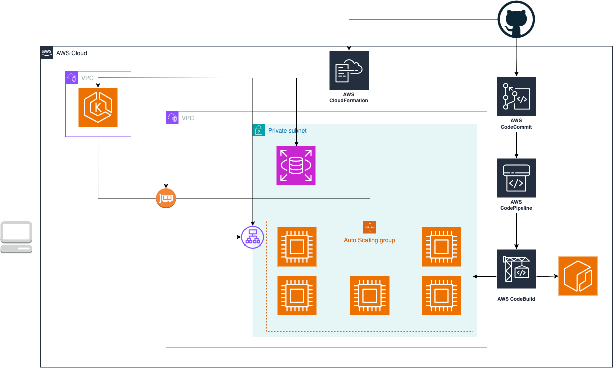

# DevOps Engineer Test

## Solution

### Item 1

There is a make file with the following targets:

- dev: run the application, it's mandatory to define `DATABASE_URL`, you can set to `sqlite://`.
- run-dev: run the application together with a PostgreSQL instance.
- test: run unit ant integration tests.
- test-integration: run integration tests.
- test-unit: run tests

Steps to run:

```bash
make DATABASE_URL="sqlite://" dev
curl 'http://127.0.0.1:8000/hello/augusto'
curl --request PUT --header 'Content-Type: application/json' --data $'{\n    "dateOfBirth": "1992-08-06"\n}' 'http://127.0.0.1:8000/hello/augusto'
curl 'http://127.0.0.1:8000/hello/augusto'
```

### Item 2



Given that the question specified a solution to be deployed either on AWS or
GCP, it was assumed that only AWS or GCP services should be used.

The following solutions were used:

- Elastic Container Registry (ECR): for storing the containers.
- CloudFormation: Infrastructure as Code (IaC) and GitOps using Git Sync.
- Relational Database Service (RDS): provisioning and database management (scaling and backups).
- Elastic Kubernetes Service (EKS): for managing and scaling the EC2 cluster instances.
- Elastic Compute Cloud (EC2): Kubernetes nodes.
- Application Load Balancer: to expose the application to the internet.
- Elastic Network Interfaces (ENI): communication between Virtual Private Cloud (VPC).
- CodeCommit, CodePipeline and CodeBuild: are responsible for the CI/CD.

### Item 3

For this item, I am assuming the following:

- That I won't need to provide scripts (like Terraform) for the Infrastructure
  defined on the previous step.
- This would be deployed on a Kubernetes cluster using helm chart defined uner
  ./k8s/hello-app.

```bash
# Requirements:
# - KUBECONFIG is set
# - Container need to be pushed to some registry, in the case of running on a minikube
make build-container
make publish-minikube
make deploy
make expose-nodeport-minikube

# If not running on minikube the following changes are necessary
# - On ./k8s/hello-app/values.yaml change the image.reposioty to reflect where the container was pushed
# - Change how the service will be expose on ./k8s/hello-app/values.yaml service.type, beacuse now is using a NodePort.
make deploy

```

## Summary

### Tasks

- [X] Design and code a simple "Hello World" application that exposes the
  following HTTP-based APIs
  - PUT /hello/<username>
  - GET /hello/<username>
- [X] Produce a system diagram of your solution deployed to either AWS or GCP
  (it's not required to support both cloud platforms).
- [X] Write configuration scripts for building and no-downtime production
  deployment of this application, keeping in mind aspects that an SRE would
  have to consider.

#### Implicit

Implicit requirements:

1. The code produced by you is expected to be of high quality.
1. The solution must have tests, runnable locally, and deployable to the cloud.
1. Use common sense.

#### Endpoints

- PUT /hello/<username> { “dateOfBirth”: “YYYY-MM-DD” }

```
Description: Saves/updates the given user’s name and date of birth in the database.

Request: PUT /hello/<username> { “dateOfBirth”: “YYYY-MM-DD” }
Response: 204 No Content

Note:
<username> must contain only letters.
YYYY-MM-DD must be a date before the today date.
```

- GET /hello/<username>

```
Description: Returns hello birthday message for the given user

Request: GET /hello/<username>
Response: 200 OK

Response Examples:
A. If username’s birthday is in N days:
{ “message”: “Hello, <username>! Your birthday is in N day(s)” }
B. If username’s birthday is today:
{ “message”: “Hello, <username>! Happy birthday!” }
Note: Use storage/database of your choice.
```
